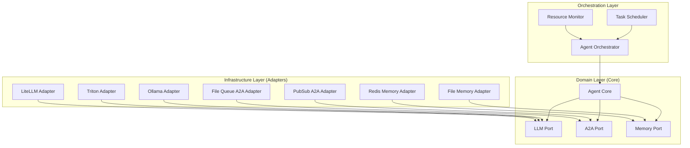
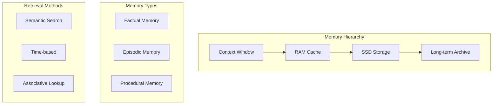
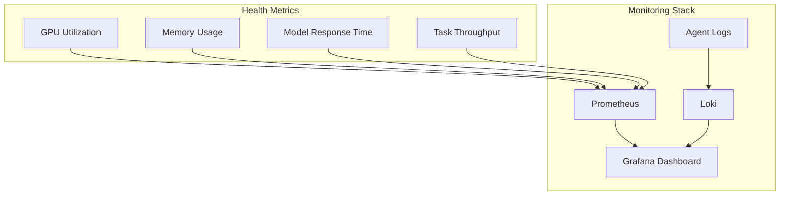

# 🔧 Edge AI Agent System: Technical Implementation

This document provides detailed technical implementation guidance for the Edge AI agent system on NVIDIA Jetson AGX Orin hardware. It covers architecture, ports and adapters design, agent communication protocols, and practical deployment considerations.

## 📑 Table of Contents

- [🔧 Edge AI Agent System: Technical Implementation](#-edge-ai-agent-system-technical-implementation)
  - [📑 Table of Contents](#-table-of-contents)
  - [🏗️ System Architecture](#️-system-architecture)
    - [Hexagonal Architecture Overview](#hexagonal-architecture-overview)
    - [Core Components Diagram](#core-components-diagram)
  - [🔌 Ports and Adapters Implementation](#-ports-and-adapters-implementation)
    - [Domain Layer (Core)](#domain-layer-core)
    - [Infrastructure Layer (Adapters)](#infrastructure-layer-adapters)
    - [Application Layer (Use Cases)](#application-layer-use-cases)
  - [🔄 Agent-to-Agent (A2A) Protocol](#-agent-to-agent-a2a-protocol)
    - [Message Format](#message-format)
    - [Routing Patterns](#routing-patterns)
    - [Communication Methods](#communication-methods)
  - [🧠  Agent Context Protocol (ACP)](#-model-context-protocol-ACP)
    - [Context Management](#context-management)
    - [Memory Strategies](#memory-strategies)
    - [Prompt Engineering](#prompt-engineering)
  - [⚙️ LiteLLM Integration](#️-litellm-integration)
    - [Configuration](#configuration)
    - [Model Routing](#model-routing)
    - [Agent-Specific Configuration](#agent-specific-configuration)
  - [📦 Agent Implementation Examples](#-agent-implementation-examples)
    - [Strategist Agent](#strategist-agent)
    - [Builder Agent](#builder-agent)
  - [🚀 Deployment Guide](#-deployment-guide)
    - [Environment Setup](#environment-setup)
    - [Agent Bootstrapping](#agent-bootstrapping)
    - [Monitoring and Maintenance](#monitoring-and-maintenance)

---

## 🏗️ System Architecture

### Hexagonal Architecture Overview

The Edge AI agent system follows a hexagonal architecture (ports and adapters pattern) to ensure:

- **Vendor neutrality**: No direct dependency on specific LLM providers
- **Modularity**: Components can be swapped or upgraded independently
- **Testability**: Core business logic separated from external dependencies
- **Flexibility**: Easy integration with new models or communication channels

### Core Components Diagram



The architecture provides clear separation of:
- **Core agent behavior**: Independent of any specific technology
- **External interfaces**: Defined as abstract ports
- **Technology implementations**: Contained in adapters

This allows you to switch LLM providers, memory storage systems, or communication mechanisms without modifying agent behavior.

---

## 🔌 Ports and Adapters Implementation

### Domain Layer (Core)

The domain layer contains the core business logic and port definitions:

```python
from abc import ABC, abstractmethod
from typing import Dict, List, Any, Optional, Protocol

# Port definitions (interfaces)
class LLMPort(Protocol):
    """Abstract interface for language model interactions."""
    def generate(self, prompt: str, system_prompt: str,
                 tools: Optional[List[Dict[str, Any]]] = None) -> str:
        """Generate a response from the language model."""
        ...

    def embed(self, text: str) -> List[float]:
        """Generate embeddings for the given text."""
        ...

class A2APort(Protocol):
    """Abstract interface for agent-to-agent communication."""
    def send_message(self, message: Dict[str, Any],
                     recipient_id: str) -> bool:
        """Send a message to another agent."""
        ...

    def receive_messages(self) -> List[Dict[str, Any]]:
        """Retrieve messages sent to this agent."""
        ...

class MemoryPort(Protocol):
    """Abstract interface for agent memory operations."""
    def store(self, key: str, data: Any) -> bool:
        """Store data in memory."""
        ...

    def retrieve(self, key: str) -> Any:
        """Retrieve data from memory."""
        ...

    def search(self, query: str, limit: int = 5) -> List[Any]:
        """Semantic search in memory."""
        ...

# Core Agent class
class Agent:
    """Core agent implementation independent of specific technologies."""

    def __init__(self,
                 agent_id: str,
                 system_prompt: str,
                 llm: LLMPort,
                 memory: MemoryPort,
                 communication: A2APort):
        self.agent_id = agent_id
        self.system_prompt = system_prompt
        self.llm = llm
        self.memory = memory
        self.communication = communication

    def process_task(self, task: Dict[str, Any]) -> Dict[str, Any]:
        """Process a task using the agent's capabilities."""
        # Implementation of agent processing logic
        # This is where agent-specific behavior is defined
        pass

    def collaborate(self, target_agent_id: str,
                   message: Dict[str, Any]) -> None:
        """Collaborate with another agent."""
        self.communication.send_message(message, target_agent_id)
```

### Infrastructure Layer (Adapters)

The infrastructure layer contains concrete implementations of the ports:

```python
import json
import os
import redis
import time
import uuid
import shutil
from typing import Dict, List, Any, Optional

# LLM Adapters
class LiteLLMAdapter(LLMPort):
    """LiteLLM adapter for unified access to various LLM providers."""

    def __init__(self, model_name: str, api_base: str = "http://localhost:4000"):
        import openai
        self.model = model_name
        openai.api_base = api_base
        openai.api_key = "not-needed-for-local"

    def generate(self, prompt: str, system_prompt: str,
                 tools: Optional[List[Dict[str, Any]]] = None) -> str:
        import openai
        messages = [
            {"role": "system", "content": system_prompt},
            {"role": "user", "content": prompt}
        ]

        kwargs = {"model": self.model, "messages": messages}
        if tools:
            kwargs["tools"] = tools

        response = openai.ChatCompletion.create(**kwargs)
        return response.choices[0].message.content

    def embed(self, text: str) -> List[float]:
        import openai
        response = openai.Embedding.create(
            model="text-embedding-ada-002",  # Default embedding model
            input=text
        )
        return response.data[0].embedding

# Memory Adapters
class RedisMemoryAdapter(MemoryPort):
    """Redis-based memory adapter for agent state."""

    def __init__(self, agent_id: str, redis_url: str = "redis://localhost:6379"):
        self.agent_id = agent_id
        self.redis = redis.from_url(redis_url)

    def store(self, key: str, data: Any) -> bool:
        full_key = f"{self.agent_id}:{key}"
        self.redis.set(full_key, json.dumps(data))
        return True

    def retrieve(self, key: str) -> Any:
        full_key = f"{self.agent_id}:{key}"
        data = self.redis.get(full_key)
        if data:
            return json.loads(data)
        return None

    def search(self, query: str, limit: int = 5) -> List[Any]:
        # In a real implementation, this would use Redis Search or a vector DB
        # This is a simplified placeholder
        return []

# A2A Communication Adapters
class FileBased_A2A_Adapter(A2APort):
    """File-based agent-to-agent communication adapter."""

    def __init__(self, agent_id: str, base_dir: str = "/tmp/agent_messages"):
        self.agent_id = agent_id
        self.inbox_dir = os.path.join(base_dir, agent_id, "inbox")
        self.outbox_dir = os.path.join(base_dir, agent_id, "outbox")

        os.makedirs(self.inbox_dir, exist_ok=True)
        os.makedirs(self.outbox_dir, exist_ok=True)

    def send_message(self, message: Dict[str, Any], recipient_id: str) -> bool:
        """Sends a message by writing it to the recipient's file-based inbox."""
        if "message_id" not in message:
            message["message_id"] = f"msg_{uuid.uuid4().hex}"
        if "sender_id" not in message:
            message["sender_id"] = self.agent_id

        base_dir_for_recipient = os.path.dirname(os.path.dirname(self.inbox_dir))
        recipient_inbox_dir = os.path.join(base_dir_for_recipient, recipient_id, "inbox")

        try:
            os.makedirs(recipient_inbox_dir, exist_ok=True)
            recipient_message_path = os.path.join(recipient_inbox_dir, f"{message['message_id']}.json")

            with open(recipient_message_path, 'w') as f:
                json.dump(message, f)
            return True
        except IOError:
            return False

    def receive_messages(self) -> List[Dict[str, Any]]:
        """Retrieves and removes messages from the agent's file-based inbox."""
        messages = []
        if not os.path.exists(self.inbox_dir):
            return messages

        for filename in os.listdir(self.inbox_dir):
            if filename.endswith('.json'):
                message_path = os.path.join(self.inbox_dir, filename)
                try:
                    with open(message_path, 'r') as f:
                        messages.append(json.load(f))
                    os.remove(message_path)
                except (json.JSONDecodeError, IOError):
                    pass
        return messages

class RedisPubSubA2AAdapter(A2APort):
    """Redis Pub/Sub based agent-to-agent communication adapter."""

    def __init__(self, agent_id: str, redis_url: str = "redis://localhost:6379"):
        self.agent_id = agent_id
        self.redis_client = redis.from_url(redis_url)
        self.pubsub = self.redis_client.pubsub(ignore_subscribe_messages=True)
        self.inbox_channel = f"agent:{self.agent_id}:inbox"

        try:
            self.pubsub.subscribe(self.inbox_channel)
        except redis.RedisError:
            raise

    def send_message(self, message: Dict[str, Any], recipient_id: str) -> bool:
        """Sends a message to the recipient agent's inbox channel via Redis Pub/Sub."""
        recipient_channel = f"agent:{recipient_id}:inbox"
        try:
            if "message_id" not in message:
                message["message_id"] = f"msg_{uuid.uuid4().hex}"
            if "sender_id" not in message:
                message["sender_id"] = self.agent_id

            self.redis_client.publish(recipient_channel, json.dumps(message))
            return True
        except redis.RedisError:
            return False

    def receive_messages(self) -> List[Dict[str, Any]]:
        """Retrieves messages from the agent's subscribed Redis inbox channel."""
        messages = []
        while True:
            try:
                raw_message = self.pubsub.get_message(timeout=0.01)
                if raw_message:
                    if raw_message["type"] == "message":
                        try:
                            message_data = json.loads(raw_message["data"])
                            messages.append(message_data)
                        except json.JSONDecodeError:
                            pass
                else:
                    break
            except redis.RedisError:
                break
        return messages

    def __del__(self):
        """Clean up PubSub subscription when the adapter is deleted."""
        try:
            if self.pubsub:
                self.pubsub.unsubscribe(self.inbox_channel)
                self.pubsub.close()
        except redis.RedisError:
            pass
```

### Application Layer (Use Cases)

The application layer orchestrates the domain and infrastructure layers:

```python
import json
import uuid

# Agent Factory (Application Service)
class AgentFactory:
    """Factory for creating and configuring agents based on a JSON configuration."""

    def __init__(self, config_path: str):
        try:
            with open(config_path, 'r') as f:
                self.config = json.load(f)
        except FileNotFoundError:
            raise
        except json.JSONDecodeError:
            raise

    def create_agent(self, agent_type: str) -> Agent:
        agent_config = self.config.get(agent_type)
        if not agent_config:
            raise ValueError(f"No configuration found for agent type: {agent_type}")

        agent_id = agent_config.get("agent_id", f"{agent_type}_{uuid.uuid4().hex[:8]}")
        system_prompt = agent_config.get("system_prompt", "You are a helpful AI agent.")

        llm_conf = agent_config.get("llm")
        if not llm_conf: raise ValueError(f"LLM configuration missing for agent {agent_type}")
        llm_adapter = self._create_llm_adapter(llm_conf)

        memory_conf = agent_config.get("memory")
        if not memory_conf: raise ValueError(f"Memory configuration missing for agent {agent_type}")
        memory_adapter = self._create_memory_adapter(memory_conf, agent_id)

        a2a_conf = agent_config.get("communication")
        if not a2a_conf: raise ValueError(f"Communication configuration missing for agent {agent_type}")
        a2a_adapter = self._create_a2a_adapter(a2a_conf, agent_id)

        return Agent(
            agent_id=agent_id,
            system_prompt=system_prompt,
            llm=llm_adapter,
            memory=memory_adapter,
            communication=a2a_adapter
        )

    def _create_llm_adapter(self, llm_config: Dict[str, Any]) -> LLMPort:
        adapter_type = llm_config.get("type")
        if adapter_type == "litellm":
            return LiteLLMAdapter(
                model_name=llm_config.get("model", "default-model"),
                api_base=llm_config.get("api_base")
            )
        raise NotImplementedError(f"LLM adapter type '{adapter_type}' not implemented.")

    def _create_memory_adapter(self, memory_config: Dict[str, Any], agent_id: str) -> MemoryPort:
        adapter_type = memory_config.get("type")
        if adapter_type == "redis":
            return RedisMemoryAdapter(
                agent_id=agent_id,
                redis_url=memory_config.get("url", "redis://localhost:6379")
            )
        raise NotImplementedError(f"Memory adapter type '{adapter_type}' not implemented.")

    def _create_a2a_adapter(self, comm_config: Dict[str, Any], agent_id: str) -> A2APort:
        adapter_type = comm_config.get("type")
        if adapter_type == "file":
            return FileBased_A2A_Adapter(
                agent_id=agent_id,
                base_dir=comm_config.get("base_dir", "/tmp/agent_messages")
            )
        elif adapter_type == "redis_pubsub":
            return RedisPubSubA2AAdapter(
                agent_id=agent_id,
                redis_url=comm_config.get("redis_url", "redis://localhost:6379")
            )
        raise NotImplementedError(f"A2A adapter type '{adapter_type}' not implemented.")
```

This hexagonal architecture provides a solid foundation for building a flexible and maintainable agent system.

---

## 🔄 Agent-to-Agent (A2A) Protocol

The A2A protocol defines how agents communicate and collaborate.

### Message Format

All inter-agent messages should follow a standard JSON structure for interoperability. Key fields include:

```json
{
  "message_id": "msg_f47ac10b-58cc-4372-a567-0e02b2c3d479",
  "sender_id": "strategist_agent_01",
  "recipient_id": "builder_agent_03",
  "timestamp": "2025-05-14T12:34:56.789Z",
  "message_type": "task_request",
  "version": "1.0",
  "payload_type": "application/json",
  "payload": {
    "task_name": "generate_report_for_project_alpha",
    "parameters": {
      "project_id": "project_alpha",
      "report_type": "financial_summary",
      "output_format": "pdf"
    },
    "dependencies": ["task_123_data_collection"]
  },
  "metadata": {
    "priority": "high",
    "correlation_id": "corr_abc_123",
    "reply_to_channel": "agent:strategist_agent_01:replies",
    "ttl_seconds": 3600,
    "trace_id": "trace_def_456"
  },
  "signature": "..."
}
```

**Key Fields Explained:**

*   `message_id`: Unique identifier for the message (e.g., UUID).
*   `sender_id`: ID of the agent sending the message.
*   `recipient_id`: ID of the target agent. Can be a specific agent ID or a group/topic ID for some patterns.
*   `timestamp`: ISO 8601 timestamp of when the message was created.
*   `message_type`: Category of the message (e.g., `task_request`, `task_status`, `data_query`, `event_notification`).
*   `version`: Version of the message schema.
*   `payload_type`: MIME type of the `payload` (e.g., `application/json`, `text/plain`).
*   `payload`: The actual content of the message. Structure depends on `message_type`.
*   `metadata`: Additional information like priority, correlation IDs for tracking, reply channels, TTL, or tracing info.
*   `signature`: (Optional) For verifying message integrity and authenticity.

### Routing Patterns

The Edge AI agent system can support several communication patterns:

1.  **Direct Communication (Point-to-Point)**: Agent A sends a message directly to Agent B.
2.  **Publish-Subscribe (Pub/Sub)**: An agent publishes a message to a topic/channel, and one or more subscribed agents receive it. Decouples senders from receivers.
3.  **Request-Response**: Agent A sends a request to Agent B and expects a response. Can be synchronous or asynchronous.
4.  **Event-Driven**: Agents react to events occurring in the system (e.g., new data available, task completion).

```mermaid
graph TD
    subgraph Direct_Communication ["🌍 Direct Communication (Point-to-Point)"]
        A1[Agent A] -->|Message| B1[Agent B]
    end

    subgraph Publish_Subscribe ["📡 Publish-Subscribe (Pub/Sub)"]
        Publisher[Agent P (Publisher)] -->|Publish(Topic X)| Broker((Message Broker/Topic))
        Broker -->|Message| Subscriber1[Agent S1 (Subscriber)]
        Broker -->|Message| Subscriber2[Agent S2 (Subscriber)]
    end

    subgraph Request_Response ["🔁 Request-Response"]
        Requester[Agent Req] -->>|1. Request| Responder[Agent Res]
        Responder -->>|2. Response| Requester
    end

    subgraph Event_Driven ["⚡ Event-Driven"]
        direction LR
        EventSource[(Event Source e.g., System Monitor)] -.->|Event Y| EA1[Agent E1]
        EventSource -.->|Event Y| EA2[Agent E2]
        EA1 -->|Action| Service1[External Service/DB]
        EA2 -->|Triggers Task| TaskHandler[Task Handler Agent]
    end
```

### Communication Methods

Agents use their configured `A2APort` adapter (e.g., `FileBased_A2A_Adapter`, `RedisPubSubA2AAdapter`) to interact. The specific method chosen depends on the desired routing pattern and system requirements.

**1. Using `FileBased_A2A_Adapter` (Direct Messaging Example):**

This adapter is suitable for simple, local inter-process communication on the same machine.

```python
from datetime import datetime, timezone
import uuid

# Assume agent_a and agent_b are instances of your Agent class,
# configured with FileBased_A2A_Adapter.

task_payload_file = {
    "task_name": "process_image_data",
    "image_path": "/data/images/img_001.jpg"
}
message_to_b_file = {
    "message_id": f"msg_{uuid.uuid4().hex}",
    "sender_id": agent_a.agent_id,
    "recipient_id": agent_b.agent_id,
    "timestamp": datetime.now(timezone.utc).isoformat(),
    "message_type": "task_assignment",
    "payload_type": "application/json",
    "payload": task_payload_file
}

if agent_a.communication.send_message(message_to_b_file, agent_b.agent_id):
    print(f"[{agent_a.agent_id}] Message sent to [{agent_b.agent_id}].")
else:
    print(f"[{agent_a.agent_id}] Failed to send message to [{agent_b.agent_id}].")

incoming_messages_file = agent_b.communication.receive_messages()
for msg_file in incoming_messages_file:
    if msg_file.get("sender_id") == agent_a.agent_id:
        print(f"[{agent_b.agent_id}] Received from [{agent_a.agent_id}]: {msg_file['payload']}")
```

**2. Using `RedisPubSubA2AAdapter` (Pub/Sub or Direct-like Messaging Example):**

Redis Pub/Sub can be used for broadcasting to multiple subscribers listening on a channel, or for direct-like messaging if an agent subscribes to a unique channel.

```python
from datetime import datetime, timezone
import uuid

alert_payload_redis = {
    "alert_level": "critical",
    "component": "llm_service",
    "details": "High latency detected."
}

alert_message_redis = {
    "message_id": f"msg_{uuid.uuid4().hex}",
    "sender_id": orchestrator_agent.agent_id,
    "recipient_id": monitoring_agent.agent_id,
    "timestamp": datetime.now(timezone.utc).isoformat(),
    "message_type": "system_alert",
    "payload_type": "application/json",
    "payload": alert_payload_redis
}

if orchestrator_agent.communication.send_message(alert_message_redis, monitoring_agent.agent_id):
    print(f"[{orchestrator_agent.agent_id}] Alert sent to [{monitoring_agent.agent_id}].")

alerts_redis = monitoring_agent.communication.receive_messages()
for alert in alerts_redis:
    if alert.get("message_type") == "system_alert":
        print(f"[{monitoring_agent.agent_id}] Received alert from [{alert.get('sender_id')}]: {alert['payload']}")
```

**Considerations for A2A Communication:**

*   **Message Serialization**: JSON is common, but other formats like Protocol Buffers or Avro can be used for performance or schema enforcement.
*   **Error Handling**: Implement retries, dead-letter queues, and monitoring for message delivery failures.
*   **Security**: Secure communication channels (e.g., TLS/SSL) and consider message encryption/signing if sensitive data is exchanged.
*   **Discovery**: How do agents find each other? This could be through a central registry, configuration, or a discovery protocol.

---

## 🧠  Agent Context Protocol (ACP)

The  Agent Context Protocol (ACP) defines how agents manage their context window and persistent memory across sessions.

### Context Management

Key strategies for context management:

1. **Sliding Window**: Keep the most recent N turns of conversation
2. **Summarization**: Periodically summarize context to reduce token usage
3. **Chunking**: Split context into retrievable chunks for on-demand access
4. **Prioritization**: Keep high-importance information in context

Implementation example:

```python
class ACPContextManager:
    """Manages context for agent LLM interactions."""

    def __init__(self, max_tokens: int = 4096, buffer_tokens: int = 512):
        self.max_tokens = max_tokens
        self.buffer_tokens = buffer_tokens
        self.contexts = {
            "system": "",
            "long_term": [],
            "short_term": [],
            "current": []
        }

    def add_message(self, message: str, category: str = "current") -> None:
        """Add a message to the specified context category."""
        if category not in self.contexts:
            raise ValueError(f"Invalid context category: {category}")

        if category in ["long_term", "short_term", "current"]:
            self.contexts[category].append(message)

    def set_system_prompt(self, prompt: str) -> None:
        """Set the system prompt."""
        self.contexts["system"] = prompt

    def get_formatted_context(self) -> List[Dict[str, str]]:
        """Get formatted context that fits within token limit."""
        import tiktoken
        enc = tiktoken.get_encoding("cl100k_base")  # OpenAI's standard encoding

        # Start with system and essential content
        messages = [{"role": "system", "content": self.contexts["system"]}]
        token_count = len(enc.encode(self.contexts["system"]))

        # Add long-term memory
        long_term_summary = "\n".join(self.contexts["long_term"][-3:])
        if long_term_summary:
            messages.append({
                "role": "system",
                "content": f"Previous context: {long_term_summary}"
            })
            token_count += len(enc.encode(long_term_summary)) + 30

        # Calculate remaining tokens for conversation
        remaining_tokens = self.max_tokens - token_count - self.buffer_tokens

        # Add as many short-term and current messages as possible
        all_messages = self.contexts["short_term"] + self.contexts["current"]
        all_messages.reverse()  # Start with most recent

        conversation = []
        for i, msg in enumerate(all_messages):
            msg_tokens = len(enc.encode(msg))
            if token_count + msg_tokens > remaining_tokens:
                break

            role = "assistant" if i % 2 == 0 else "user"
            conversation.append({"role": role, "content": msg})
            token_count += msg_tokens

        conversation.reverse()
        messages.extend(conversation)

        return messages

    def summarize_context(self, llm: LLMPort) -> None:
        """Summarize the current context to create a new long-term memory entry."""
        if not self.contexts["current"]:
            return

        combined = "\n".join(self.contexts["current"])
        summary_prompt = f"Summarize the following conversation in a concise paragraph:\n{combined}"
        summary = llm.generate(summary_prompt, "You are a helpful summarization assistant.")

        self.contexts["long_term"].append(summary)
        self.contexts["short_term"].extend(self.contexts["current"][-3:])
        self.contexts["current"] = []
```

### Memory Strategies

Effective memory management for edge AI agents:

1. **Vector Embeddings**: Store embeddings for semantic retrieval
2. **Hierarchical Storage**: Hot memory (in context) → warm memory (in RAM) → cold memory (on disk)
3. **Progressive Summarization**: Iteratively summarize as memory ages
4. **Contextual Retrieval**: Just-in-time memory fetching based on relevance



### Prompt Engineering

Effective system prompts typically have these components:

1. **Identity**: Define the agent's role and purpose
2. **Constraints**: Specify operational boundaries and limitations
3. **Capabilities**: Detail what tools or functions the agent can use
4. **Communication Style**: Define tone, verbosity, and format
5. **Guidelines**: Add domain-specific instructions or ethical constraints

Example system prompt template:

```
You are {agent_name}, a specialized AI assistant focused on {primary_role}.

## Capabilities and Tools
- {tool_1}: {description}
- {tool_2}: {description}
- {tool_3}: {description}

## Communication Guidelines
- {guideline_1}
- {guideline_2}
- {guideline_3}

## Constraints and Limitations
- {constraint_1}
- {constraint_2}
- {constraint_3}

## Style and Format
Always respond in the following format:
{format_specification}

## Memory Instructions
{memory_recall_instructions}
```

---

## ⚙️ LiteLLM Integration

LiteLLM provides a unified API for working with different LLM backends.

### Configuration

Create a `litellm.config.yaml` file:

```yaml
# LiteLLM Configuration for Edge AI Agent System

proxy_server: true
port: 4000
api_base: "http://localhost:4000"

model_list:
  # === OLLAMA LOCAL MODELS ===
  - model_name: ollama-mistral
    litellm_provider: ollama
    ollama_model_name: mistral

  - model_name: ollama-codellama
    litellm_provider: ollama
    ollama_model_name: codellama:7b-code-q4_K_M

  - model_name: ollama-llava
    litellm_provider: ollama
    ollama_model_name: llava:13b
    max_tokens: 2048

  # === TRITON INFERENCE SERVER ===
  - model_name: triton-codellama
    litellm_provider: triton
    model: codellama
    triton_url: http://localhost:8001
    max_tokens: 2048

  # === OPENAI CLOUD MODELS ===
  - model_name: openai-gpt-4
    litellm_provider: openai
    api_key: ${OPENAI_API_KEY}  # From environment variable
    model: gpt-4
    max_tokens: 4096

  # === DEFAULT FALLBACK ===
  - model_name: default
    litellm_provider: ollama
    ollama_model_name: mistral
```

Start the LiteLLM proxy server:

```bash
litellm --config litellm.config.yaml
```

### Model Routing

Configure agent-specific model routing based on task requirements:

```python
def get_model_for_task(agent_type: str, task_type: str) -> str:
    """Get the appropriate model for an agent and task type."""

    # Task-based model routing
    task_models = {
        "code_generation": "ollama-codellama",
        "planning": "ollama-mistral",
        "creative_writing": "ollama-mistral",
        "reasoning": "openai-gpt-4",
        "image_understanding": "ollama-llava"
    }

    # Agent-specific overrides
    agent_specific = {
        "builder": {
            "code_generation": "triton-codellama",  # Use Triton for Builder
        },
        "critic": {
            "reasoning": "openai-gpt-4"  # Always use GPT-4 for Critic's reasoning
        }
    }

    # Check for agent-specific model first
    if agent_type in agent_specific and task_type in agent_specific[agent_type]:
        return agent_specific[agent_type][task_type]

    # Fall back to task-based model
    if task_type in task_models:
        return task_models[task_type]

    # Default fallback
    return "ollama-mistral"
```

### Agent-Specific Configuration

Different agents need different model configurations:

| Agent Type | Primary Model | Task Types | Rationale |
|------------|--------------|------------|-----------|
| Strategist | mistral-7b | reasoning, planning | Good balance of planning and resource usage |
| Builder | codellama-7b | code_generation | Optimized for code tasks |
| Critic | gpt-4 | reasoning | Higher reasoning capacity for critical analysis |
| Synthesizer | mistral-7b | summarization | Good comprehension-to-token ratio |
| Researcher | llava | image_understanding, research | Multimodal capabilities |

Example agent factory with LiteLLM integration:

```python
class AgentFactory:
    """Creates properly configured agents with appropriate LLM models."""

    def create_strategist(self) -> Agent:
        """Create a Strategist agent."""
        llm = LiteLLMAdapter(model_name="ollama-mistral")
        memory = RedisMemoryAdapter(agent_id="strategist")
        comms = RedisPubSubA2AAdapter(agent_id="strategist")

        return Agent(
            agent_id="strategist",
            system_prompt=STRATEGIST_PROMPT,
            llm=llm,
            memory=memory,
            communication=comms
        )

    def create_builder(self) -> Agent:
        """Create a Builder agent."""
        llm = LiteLLMAdapter(model_name="ollama-codellama")
        memory = RedisMemoryAdapter(agent_id="builder")
        comms = RedisPubSubA2AAdapter(agent_id="builder")

        return Agent(
            agent_id="builder",
            system_prompt=BUILDER_PROMPT,
            llm=llm,
            memory=memory,
            communication=comms
        )
```

---

## 📦 Agent Implementation Examples

### Strategist Agent

The Strategist agent aligns tasks with strategic goals and priorities.

```python
# Strategist Agent Implementation

STRATEGIST_PROMPT = """
You are "The Strategist", an AI agent responsible for long-range alignment.
You help ensure that all work supports high-level goals, OKRs, and vision.
You translate vague intentions into measurable direction, resolve ambiguity,
and detect misalignment or scope creep.

## Capabilities
- You can review projects and plans for alignment with strategic goals
- You can prioritize tasks based on strategic importance
- You can detect scope creep and mission drift
- You can translate high-level objectives into measurable targets

## Style and Format
- Be concise and clear
- Use structured frameworks when helpful
- Ask clarifying questions before providing direction
- Frame suggestions in terms of strategic impact

## Communication Guidelines
- Avoid getting lost in tactical details
- Don't prescribe exact implementation methods
- Always tie recommendations to broader context and goals
"""

class StrategistAgent(Agent):
    """Specialized implementation of the Strategist agent."""

    def __init__(self, llm: LLMPort, memory: MemoryPort, communication: A2APort):
        super().__init__(
            agent_id="strategist",
            system_prompt=STRATEGIST_PROMPT,
            llm=llm,
            memory=memory,
            communication=communication
        )

    def align_task_with_goals(self, task: Dict[str, Any]) -> Dict[str, Any]:
        """Align a task with strategic goals."""
        goals = self.memory.retrieve("strategic_goals")
        if not goals:
            # If no stored goals, just return the task
            return task

        prompt = f"""
        Task: {task.get('description')}

        Strategic Goals:
        {json.dumps(goals, indent=2)}

        Please analyze this task in relation to our strategic goals:
        1. How does this task align with our strategic goals?
        2. Should this task be prioritized, modified, or reconsidered?
        3. What specific success metrics should be used to evaluate this task?

        Return your analysis as JSON with the following structure:
        {{
            "alignment_score": 0-10,
            "strategic_impact": "description",
            "recommended_priority": "high/medium/low",
            "suggested_modifications": ["mod1", "mod2"],
            "success_metrics": ["metric1", "metric2"]
        }}
        """

        result = self.llm.generate(prompt, self.system_prompt)

        try:
            analysis = json.loads(result)
            # Merge the analysis with the original task
            task.update({
                "strategic_analysis": analysis
            })
            return task
        except (json.JSONDecodeError, AttributeError):
            # Handle error case
            task.update({
                "strategic_analysis": {
                    "error": "Failed to parse analysis",
                    "raw_output": result
                }
            })
            return task

    def review_project_plan(self, plan: Dict[str, Any]) -> Dict[str, Any]:
        """Review a project plan for strategic alignment."""
        # Implementation omitted for brevity
        pass

    def process_task(self, task: Dict[str, Any]) -> Dict[str, Any]:
        """Process incoming tasks based on their type."""
        task_type = task.get("type", "unknown")

        if task_type == "align_task":
            return self.align_task_with_goals(task)
        elif task_type == "review_plan":
            return self.review_project_plan(task)
        else:
            # Unknown task type
            return {
                "error": f"Unknown task type: {task_type}",
                "original_task": task
            }
```

### Builder Agent

The Builder agent transforms specifications into working code and configurations.

```python
# Builder Agent Implementation

BUILDER_PROMPT = """
You are "The Builder", an AI agent designed for local, low-latency code development.
You write, refactor, and explain code clearly. You are concise, follow best practices,
and default to modular design. You prefer Python but can handle Bash, YAML, and Markdown.

## Capabilities
- You can generate code based on specifications
- You can refactor existing code for better quality
- You can create configuration files and scripts
- You can explain how code works

## Style and Format
- Write code in complete, functional blocks
- Include clear comments for complex sections
- Follow language-specific best practices
- Use type hints in Python code

## Communication Guidelines
- If requirements are unclear, ask for clarification
- If you can't implement something, explain why
- Provide explanations after code, not before
- Include setup instructions when relevant
"""

class BuilderAgent(Agent):
    """Specialized implementation of the Builder agent."""

    def __init__(self, llm: LLMPort, memory: MemoryPort, communication: A2APort):
        super().__init__(
            agent_id="builder",
            system_prompt=BUILDER_PROMPT,
            llm=llm,
            memory=memory,
            communication=communication
        )

    def generate_code(self, spec: Dict[str, Any]) -> Dict[str, Any]:
        """Generate code based on a specification."""
        language = spec.get("language", "python")
        description = spec.get("description", "")
        requirements = spec.get("requirements", [])

        prompt = f"""
        Create {language} code based on the following specification:

        Description: {description}

        Requirements:
        {self._format_list(requirements)}

        Additional context:
        {spec.get('context', '')}

        Return your solution as a code block with appropriate comments.
        """

        # Use specific code model for this task
        code_llm = LiteLLMAdapter(model_name="ollama-codellama")
        result = code_llm.generate(prompt, self.system_prompt)

        # Extract code block from result
        code = self._extract_code_block(result, language)

        return {
            "type": "code_generation_result",
            "language": language,
            "code": code,
            "explanation": result.replace(code, "").strip(),
            "original_spec": spec
        }

    def _format_list(self, items: List[str]) -> str:
        """Format a list of items as a bulleted list."""
        return "\n".join([f"- {item}" for item in items])

    def _extract_code_block(self, text: str, language: str) -> str:
        """Extract code block from text."""
        import re
        pattern = rf"```{language}(.*?)```"
        matches = re.findall(pattern, text, re.DOTALL)

        if matches:
            return matches[0].strip()

        # Fallback: try without language specifier
        pattern = r"```(.*?)```"
        matches = re.findall(pattern, text, re.DOTALL)

        if matches:
            return matches[0].strip()

        # If no code block found, return the original text
        return text

    def process_task(self, task: Dict[str, Any]) -> Dict[str, Any]:
        """Process incoming tasks based on their type."""
        task_type = task.get("type", "unknown")

        if task_type == "generate_code":
            return self.generate_code(task)
        elif task_type == "refactor_code":
            # Implementation omitted for brevity
            pass
        elif task_type == "explain_code":
            # Implementation omitted for brevity
            pass
        else:
            # Unknown task type
            return {
                "error": f"Unknown task type: {task_type}",
                "original_task": task
            }
```

---

## 🚀 Deployment Guide

### Environment Setup

1. **Prerequisites**:
   - NVIDIA Jetson AGX Orin (64GB)
   - JetPack installed (latest version)
   - Docker and Docker Compose
   - Python 3.10+

2. **Install Dependencies**:
```bash
# Create a new virtual environment
python3 -m venv edge-ai-venv
source edge-ai-venv/bin/activate

# Install required packages
pip install litellm fastapi uvicorn redis openai pydantic tiktoken
```

3. **Set Up Ollama**:
```bash
# Install Ollama for Jetson
curl -fsSL https://ollama.com/install.sh | sh

# Pull required models
ollama pull mistral:7b-q4_K_M
ollama pull codellama:7b-code-q4_K_M
ollama pull llava:13b
```

4. **Set Up Redis**:
```bash
# Install Redis using Docker
docker run -d --name redis-stack -p 6379:6379 -p 8001:8001 redis/redis-stack:latest
```

### Agent Bootstrapping

Create a bootstrap script to start the agent system:

```python
# bootstrap.py
import os
import argparse
from agent_factory import AgentFactory
from orchestrator import AgentOrchestrator

def main():
    parser = argparse.ArgumentParser(description="Edge AI Agent System Bootstrap")
    parser.add_argument("--config", default="config.json", help="Configuration file path")
    parser.add_argument("--agents", nargs="+", default=["strategist", "builder"],
                       help="Agents to start")
    args = parser.parse_args()

    # Initialize the factory
    factory = AgentFactory(args.config)

    # Create requested agents
    agents = {}
    for agent_type in args.agents:
        print(f"Creating agent: {agent_type}")
        try:
            agent = factory.create_agent(agent_type)
            agents[agent_type] = agent
        except Exception as e:
            print(f"Failed to create agent {agent_type}: {e}")

    # Start the orchestrator
    orchestrator = AgentOrchestrator(agents)
    orchestrator.start()

if __name__ == "__main__":
    main()
```

Run the bootstrap script:
```bash
python bootstrap.py --agents strategist builder critic
```

### Monitoring and Maintenance

1. **Resource Monitoring**:
   - Use `jetson_stats` to monitor GPU/CPU usage
   - Set up Prometheus to track system metrics
   - Create a simple dashboard in Grafana

2. **Log Management**:
   - Centralize logs using loguru
   - Set up log rotation to prevent disk fill
   - Create an agent error dashboard

3. **Model Management**:
   - Periodically update models with `ollama pull`
   - Monitor model performance metrics
   - Create backup of agent memory stores

4. **Health Check Endpoint**:
   - Implement a simple HTTP endpoint for system health checks
   - Include agent status, model availability, and memory usage

Example monitoring dashboard:



Create a simple health check endpoint:

```python
from fastapi import FastAPI
import psutil
import subprocess

app = FastAPI(title="Edge AI Agent Monitor")

@app.get("/health")
async def health_check():
    """Check the health of the agent system."""
    # Check system resources
    memory = psutil.virtual_memory()

    # Check if Ollama is running
    ollama_status = "running"
    try:
        subprocess.check_output(["pgrep", "ollama"])
    except subprocess.CalledProcessError:
        ollama_status = "stopped"

    # Check if Redis is running
    redis_status = "running"
    try:
        import redis
        r = redis.Redis()
        r.ping()
    except Exception:
        redis_status = "stopped"

    # Check active agents (this would come from your agent registry)
    active_agents = ["strategist", "builder"]

    return {
        "status": "ok",
        "system": {
            "cpu_percent": psutil.cpu_percent(),
            "memory_percent": memory.percent,
            "memory_available_gb": round(memory.available / (1024**3), 2)
        },
        "services": {
            "ollama": ollama_status,
            "redis": redis_status,
            "litellm": "running"  # You'd need to add actual check
        },
        "agents": {
            "active": active_agents,
            "total": len(active_agents)
        }
    }
```

This comprehensive technical implementation guide provides the foundation for building and deploying your Edge AI agent system on the NVIDIA Jetson AGX Orin platform.
