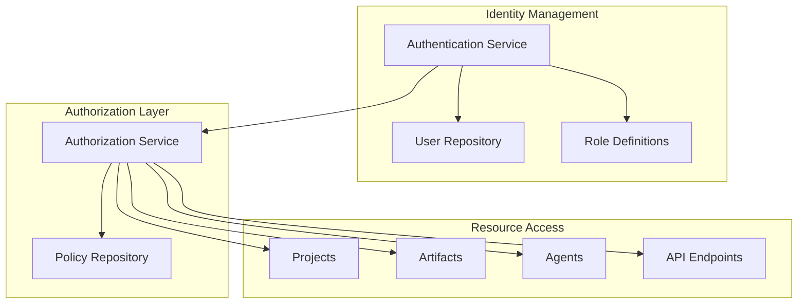
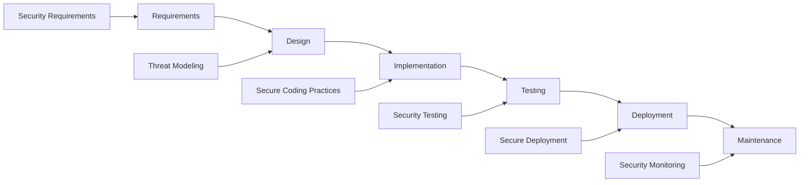

# Edge AI Agent System: Security and Compliance Guide

## Overview

This document outlines the security considerations, compliance requirements, and best practices for implementing and operating the Edge AI Agent System. Operating AI agents on edge hardware presents unique security challenges that must be addressed systematically to ensure data protection, system integrity, and regulatory compliance.

## Security Architecture

### Defense-in-Depth Approach

The Edge AI Agent System implements a defense-in-depth security approach with multiple layers of protection:

1. **Hardware Security**
   - Secure boot leveraging NVIDIA Jetson security features
   - Hardware-level encryption (if supported by the device)
   - Physical access controls and tamper detection

2. **System Security**
   - Minimal OS installation with unnecessary services disabled
   - Regular security updates and patch management
   - Host-based firewall configuration
   - Security-hardened container environments

3. **Application Security**
   - Input validation and sanitization
   - Proper error handling and logging
   - Authentication and authorization controls
   - Secure API design principles

4. **Data Security**
   - Encryption for sensitive data at rest
   - Access controls for artifacts and agent configurations
   - Secure deletion practices
   - Backup encryption

### Authentication and Authorization

The system implements a comprehensive identity and access management framework:



1. **Authentication Methods**
   - API key authentication for programmatic access
   - Username/password with MFA for user interfaces
   - OAuth2/OpenID Connect for third-party integration
   - JWT-based token management

2. **Authorization Model**
   - Role-based access control (RBAC) for system-wide permissions
   - Attribute-based access control (ABAC) for fine-grained artifact access
   - Resource ownership and delegation
   - Permission inheritance based on project hierarchy

3. **Identity Lifecycle Management**
   - User provisioning and deprovisioning
   - Temporary access and time-based expiration
   - Credential rotation and management
   - Audit of identity changes

## Data Protection

### Data Classification

All data in the Edge AI Agent System is classified according to sensitivity level:

| Classification | Description | Examples | Protection Measures |
|----------------|-------------|----------|---------------------|
| Public | Non-sensitive information | Open-source artifacts, public documentation | Basic access controls |
| Internal | Business information not for public disclosure | Project plans, team assignments | Role-based access, basic encryption |
| Confidential | Sensitive information | Proprietary algorithms, competitive research | Strong encryption, strict access limits, audit logging |
| Restricted | Highly sensitive information | Personal data, trade secrets | End-to-end encryption, compartmentalized access, enhanced monitoring |

### Data Handling Procedures

1. **Data Collection**
   - Collect only necessary data (data minimization)
   - Clearly document data sources and lineage
   - Validate data integrity upon collection

2. **Data Storage**
   - Encrypt confidential and restricted data at rest
   - Implement time-to-live (TTL) policies for temporary data
   - Securely store encryption keys separate from data

3. **Data Processing**
   - Process data in secure memory spaces
   - Implement least privilege for processing agents
   - Sanitize inputs and outputs to prevent injection attacks

4. **Data Transmission**
   - Encrypt all data in transit using TLS 1.3+
   - Validate endpoints before transmission
   - Implement bandwidth limiting to prevent data exfiltration

5. **Data Deletion**
   - Securely delete data when no longer needed
   - Implement retention policies based on data classification
   - Maintain deletion logs for audit purposes

## Agent Security Controls

### Agent Isolation

Each agent operates within a controlled environment with specifically defined boundaries:

1. **Process Isolation**
   - Each agent runs in a separate process or container
   - Resource limits prevent denial-of-service
   - Memory isolation prevents cross-agent contamination

2. **Filesystem Isolation**
   - Chroot or container filesystem isolation
   - Read-only mounts for system resources
   - Temporary filesystem for transient operations

3. **Network Isolation**
   - Internal network segmentation
   - Agent-specific firewall rules
   - Traffic filtering based on agent purpose

### Agent Behavior Controls

Mechanisms to ensure agents behave as intended:

1. **Input Validation**
   - Sanitize all inputs to agents, including prompts and parameters
   - Validate structured data against schemas
   - Apply rate limits to prevent abuse

2. **Output Filtering**
   - Inspect agent outputs for sensitive information
   - Apply content filters to prevent harmful outputs
   - Implement output rate limiting

3. **Behavioral Monitoring**
   - Track resource usage patterns
   - Monitor API calls and communication patterns
   - Alert on anomalous behavior

### Custom Agent Security

Special considerations for custom agents created by users:

1. **Sandboxing**
   - Run in highly restricted environments
   - Limited tool access based on purpose
   - Pre-execution validation of agent configuration

2. **Grounding Verification**
   - Verify grounding artifacts don't contain malicious content
   - Scan for sensitive information before use
   - Validate tool usage permissions

3. **External Libraries**
   - Scan external dependencies for vulnerabilities
   - Validate signatures and integrity
   - Restrict network access during execution

## Regulatory Compliance

### Compliance Framework

The Edge AI Agent System addresses key regulatory requirements across multiple domains:

1. **Data Privacy Regulations**
   - GDPR (General Data Protection Regulation)
   - CCPA/CPRA (California Consumer Privacy Act/California Privacy Rights Act)
   - HIPAA (Health Insurance Portability and Accountability Act) where applicable
   - Industry-specific regulations (finance, healthcare, etc.)

2. **AI Ethics Guidelines**
   - Transparency in AI decision-making
   - Fairness and bias mitigation
   - Human oversight and intervention capabilities
   - Accountability and explainability

3. **Information Security Standards**
   - ISO 27001 (Information Security Management)
   - NIST Cybersecurity Framework
   - Industry-specific security standards

### Compliance Controls

Implemented controls to meet regulatory requirements:

1. **Documentation**
   - System architecture and data flow documentation
   - Risk assessments and mitigation plans
   - Agent behavior specifications
   - Incident response procedures

2. **Technical Controls**
   - Audit logging and monitoring
   - Access controls and encryption
   - Data anonymization and pseudonymization
   - Retention and deletion controls

3. **Procedural Controls**
   - Regular compliance assessments
   - Training and awareness
   - Supplier/vendor management
   - Incident response and breach notification

## Risk Assessment and Mitigation

### Key Risks and Mitigation Strategies

| Risk Category | Specific Risks | Mitigation Strategies |
|---------------|----------------|------------------------|
| **Data Security** | - Unauthorized access to artifacts<br>- Data exfiltration<br>- Improper data handling | - Comprehensive access controls<br>- Encryption at rest and in transit<br>- Data loss prevention controls |
| **Model Security** | - Prompt injection attacks<br>- Model poisoning<br>- Output manipulation | - Input sanitization<br>- Model integrity verification<br>- Output validation and filtering |
| **System Integrity** | - Unauthorized system modifications<br>- Component tampering<br>- Configuration drift | - Secure boot mechanisms<br>- Code signing and verification<br>- Configuration management |
| **Operational Security** | - Resource exhaustion<br>- Denial of service<br>- System misuse | - Resource quotas and limits<br>- Monitoring and alerting<br>- User activity auditing |
| **Compliance Risks** | - Regulatory violations<br>- Privacy breaches<br>- Inadequate documentation | - Compliance monitoring<br>- Regular audits<br>- Documentation management |

### Risk Assessment Process

1. **Identify Assets**
   - Catalog all system components
   - Classify by criticality and sensitivity
   - Document dependencies

2. **Identify Threats**
   - External threat actors
   - Internal threats and misuse
   - Environmental and operational threats

3. **Assess Vulnerabilities**
   - Security scanning and testing
   - Configuration review
   - Threat modeling

4. **Evaluate Impact**
   - Business impact analysis
   - Data sensitivity assessment
   - Regulatory implications

5. **Implement Controls**
   - Preventive controls
   - Detective controls
   - Corrective controls

6. **Monitor and Reassess**
   - Continuous monitoring
   - Periodic reassessment
   - Adjustment of controls

## Security Monitoring and Incident Response

### Monitoring Framework

The system implements a comprehensive monitoring framework focusing on:

1. **Agent Activity Monitoring**
   - Agent operations and resource usage
   - Interaction patterns between agents
   - Tool usage and API calls

2. **System Monitoring**
   - Infrastructure health and performance
   - System access and authentication events
   - Configuration changes

3. **Data Access Monitoring**
   - Artifact access patterns
   - Unusual data retrieval or modification
   - Privilege escalation attempts

4. **Network Monitoring**
   - Internal communication patterns
   - External data transfers
   - API usage patterns

### Alerting Strategy

```python
class SecurityAlert:
    """Definition of security alert structure."""

    def __init__(self,
                 alert_id: str,
                 severity: Literal["low", "medium", "high", "critical"],
                 source: str,
                 description: str,
                 affected_components: List[str],
                 recommended_actions: List[str],
                 timestamp: datetime):
        self.alert_id = alert_id
        self.severity = severity
        self.source = source
        self.description = description
        self.affected_components = affected_components
        self.recommended_actions = recommended_actions
        self.timestamp = timestamp
```

Alert severity levels and response times:

| Severity | Description | Response Time | Notification Channels |
|----------|-------------|---------------|------------------------|
| Low | Potential issue, requires attention | 24 hours | Dashboard, email |
| Medium | Security concern that should be addressed | 8 hours | Dashboard, email, messaging |
| High | Significant security issue requiring prompt action | 2 hours | Dashboard, email, messaging, phone |
| Critical | Severe security incident with immediate impact | Immediate | All channels + emergency contact |

### Incident Response Plan

1. **Preparation**
   - Documented incident response procedures
   - Defined roles and responsibilities
   - Regular incident response training

2. **Detection and Analysis**
   - Alert triage and validation
   - Scope determination
   - Impact assessment

3. **Containment**
   - Short-term containment actions
   - System isolation where necessary
   - Evidence preservation

4. **Eradication**
   - Remove compromise
   - Patch vulnerabilities
   - Rebuild affected systems if necessary

5. **Recovery**
   - Restore from clean backups
   - Verify system integrity
   - Gradual return to operation

6. **Post-Incident Activity**
   - Root cause analysis
   - Documentation updates
   - Process improvements

## Secure Deployment Guidelines

### Secure Installation

1. **Environment Preparation**
   - Harden base operating system
   - Apply all security patches
   - Configure secure boot and TPM (if available)
   - Enable disk encryption

2. **Secure Configuration**
   - Use configuration templates with hardened defaults
   - Implement secrets management solution
   - Configure strong authentication
   - Enable audit logging

3. **Network Configuration**
   - Configure firewall rules
   - Set up network segregation
   - Implement TLS for all communications
   - Configure intrusion detection

### Secure Operations

1. **Regular Maintenance**
   - Apply security patches promptly
   - Perform regular configuration reviews
   - Update agent models and tools securely
   - Rotate credentials periodically

2. **Backup and Recovery**
   - Implement encrypted backups
   - Test restoration procedures
   - Maintain offsite backup copies
   - Document recovery process

3. **Change Management**
   - Review changes for security impact
   - Test changes in isolated environment
   - Maintain change history
   - Ability to rollback changes

## Security Testing

### Testing Methodology

1. **Static Analysis**
   - Code review for security issues
   - Configuration analysis
   - Dependency scanning
   - Secret detection

2. **Dynamic Analysis**
   - Vulnerability scanning
   - Penetration testing
   - Fuzzing of inputs
   - API security testing

3. **Agent-Specific Testing**
   - Prompt injection testing
   - Data leakage testing
   - Boundary testing
   - Resource exhaustion testing

### Testing Schedule

| Test Type | Frequency | Responsibility | Documentation |
|-----------|-----------|----------------|---------------|
| Security code review | Continuous | Development team | Code review reports |
| Dependency scanning | Daily | Security automation | Vulnerability reports |
| Configuration review | Weekly | Security team | Configuration assessment |
| Vulnerability scanning | Monthly | Security team | Scan results and remediation plan |
| Penetration testing | Quarterly | External security partner | Pentest reports |
| Red team exercise | Annually | Red team | Attack simulation report |

## Secure Development Practices

### Secure SDLC Integration



1. **Planning Phase**
   - Include security requirements
   - Perform threat modeling
   - Define security acceptance criteria

2. **Development Phase**
   - Follow secure coding guidelines
   - Use security-focused code reviews
   - Implement proper error handling

3. **Testing Phase**
   - Include security test cases
   - Perform security-focused testing
   - Address security findings

4. **Deployment Phase**
   - Secure configuration management
   - Secrets management
   - Deployment verification

### Code Security Guidelines

1. **Input Validation**
   ```python
   def validate_prompt(prompt: str) -> bool:
       """Validate that a prompt doesn't contain injection attempts."""
       # Check for common injection patterns
       injection_patterns = [
           r"ignore previous instructions",
           r"disregard earlier prompts",
           # Add more patterns as needed
       ]

       for pattern in injection_patterns:
           if re.search(pattern, prompt, re.IGNORECASE):
               logger.warning(f"Potential prompt injection detected: {pattern}")
               return False

       return True
   ```

2. **Error Handling**
   ```python
   def process_agent_request(request: Dict) -> Dict:
       """Process a request to an agent with proper error handling."""
       try:
           # Validate the request
           if not validate_request(request):
               return {"error": "Invalid request format", "code": "INVALID_FORMAT"}

           # Process the request
           result = agent_processor.process(request)
           return {"result": result}

       except AuthorizationError as e:
           logger.error(f"Authorization error: {str(e)}")
           return {"error": "Not authorized", "code": "UNAUTHORIZED"}

       except RateLimitError as e:
           logger.warning(f"Rate limit exceeded: {str(e)}")
           return {"error": "Rate limit exceeded", "code": "RATE_LIMITED"}

       except Exception as e:
           # Log the full error for internal debugging
           logger.exception(f"Unexpected error processing request: {str(e)}")
           # Return a generic error message to the user
           return {"error": "Internal processing error", "code": "INTERNAL_ERROR"}
   ```

3. **Secure Communications**
   ```python
   def setup_agent_communication(agent_id: str) -> CommunicationClient:
       """Set up secure communication for an agent."""
       # Create client with TLS configuration
       client = CommunicationClient(
           cert_path=f"/certs/{agent_id}/cert.pem",
           key_path=f"/certs/{agent_id}/key.pem",
           ca_path="/certs/ca/ca.pem",
           verify=True,
           cipher_suites=SECURE_CIPHER_SUITES
       )

       # Set up mutual TLS
       client.enable_mtls()

       return client
   ```

## Appendix

### Security Configuration Examples

#### Secure Redis Configuration

```ini
# /etc/redis/redis.conf
bind 127.0.0.1
port 0
unixsocket /var/run/redis/redis.sock
unixsocketperm 770
protected-mode yes
requirepass <strong-password>
rename-command FLUSHDB ""
rename-command FLUSHALL ""
rename-command DEBUG ""
```

#### Secure FastAPI Configuration

```python
from fastapi import FastAPI, Depends, HTTPException, status
from fastapi.security import OAuth2PasswordBearer
from jose import JWTError, jwt

# Security settings
ALGORITHM = "HS256"
ACCESS_TOKEN_EXPIRE_MINUTES = 30

app = FastAPI(
    title="Edge AI Agent API",
    description="API for Edge AI Agent System",
    version="1.0.0",
    openapi_url="/api/v1/openapi.json",
    docs_url="/api/v1/docs",
    redoc_url="/api/v1/redoc",
)

# Middleware for security headers
app.add_middleware(
    CORSMiddleware,
    allow_origins=["https://yourdomain.com"],
    allow_credentials=True,
    allow_methods=["*"],
    allow_headers=["*"],
)

# Add security headers
@app.middleware("http")
async def add_security_headers(request, call_next):
    response = await call_next(request)
    response.headers["X-Content-Type-Options"] = "nosniff"
    response.headers["X-Frame-Options"] = "DENY"
    response.headers["Content-Security-Policy"] = "default-src 'self'"
    response.headers["Strict-Transport-Security"] = "max-age=31536000; includeSubDomains"
    return response

# Authentication
oauth2_scheme = OAuth2PasswordBearer(tokenUrl="token")

async def get_current_user(token: str = Depends(oauth2_scheme)):
    credentials_exception = HTTPException(
        status_code=status.HTTP_401_UNAUTHORIZED,
        detail="Could not validate credentials",
        headers={"WWW-Authenticate": "Bearer"},
    )
    try:
        payload = jwt.decode(token, SECRET_KEY, algorithms=[ALGORITHM])
        username: str = payload.get("sub")
        if username is None:
            raise credentials_exception
    except JWTError:
        raise credentials_exception
    user = get_user(username)
    if user is None:
        raise credentials_exception
    return user
```

#### Secure Docker Compose Configuration

```yaml
version: '3.8'

services:
  edgeai-api:
    image: edgeai-api:${TAG:-latest}
    build:
      context: .
      dockerfile: ./Dockerfile
    restart: unless-stopped
    security_opt:
      - no-new-privileges:true
    cap_drop:
      - ALL
    cap_add:
      - NET_BIND_SERVICE
    healthcheck:
      test: ["CMD", "curl", "-f", "http://localhost:8000/health"]
      interval: 30s
      timeout: 10s
      retries: 3
      start_period: 20s
    networks:
      - edge-net
    volumes:
      - ./certs:/app/certs:ro
      - ./config:/app/config:ro
      - ./data:/app/data
      - ${LOG_PATH:-./logs}:/app/logs
    environment:
      - REDIS_PASSWORD_FILE=/app/config/redis_password
      - JWT_SECRET_FILE=/app/config/jwt_secret
      - LOG_LEVEL=INFO
    depends_on:
      - redis

  redis:
    image: redis:alpine
    command: ["redis-server", "/usr/local/etc/redis/redis.conf"]
    restart: unless-stopped
    security_opt:
      - no-new-privileges:true
    networks:
      - edge-net
    volumes:
      - ./config/redis.conf:/usr/local/etc/redis/redis.conf:ro
      - redis-data:/data

networks:
  edge-net:
    driver: bridge
    internal: true

volumes:
  redis-data:
    driver: local
```

### Security Checklists

#### Deployment Security Checklist

- [ ] All default credentials have been changed
- [ ] Strong, unique passwords are used for all accounts
- [ ] Unnecessary services and ports are disabled
- [ ] Firewall is configured to allow only required connections
- [ ] All communications use TLS 1.2+ with strong cipher suites
- [ ] File permissions follow principle of least privilege
- [ ] Secrets are stored securely (not in code or config files)
- [ ] Security monitoring and logging are enabled
- [ ] Automated security scanning is configured
- [ ] Backup and recovery procedures are tested

#### Code Security Checklist

- [ ] Input validation is implemented for all user inputs
- [ ] Output encoding is used to prevent injection attacks
- [ ] Authentication and authorization checks are in place
- [ ] Sensitive data is encrypted at rest and in transit
- [ ] Error handling doesn't expose sensitive information
- [ ] Logging doesn't include sensitive data
- [ ] Dependencies are scanned for vulnerabilities
- [ ] Secure coding guidelines are followed
- [ ] Code has undergone security review
- [ ] Security tests are included in test suite

### Reference Materials

- NIST Cybersecurity Framework
- OWASP Top 10
- CIS Benchmarks for relevant platforms
- GDPR compliance guidelines
- ISO 27001 standards
- NVIDIA Jetson security documentation

## Conclusion

Security and compliance are critical aspects of the Edge AI Agent System. By implementing the principles and practices outlined in this document, organizations can ensure their Edge AI deployment remains secure, reliable, and compliant with relevant regulations.

The layered security approach addresses the unique challenges of edge AI operations while enabling the flexible, intelligent functionality that makes the system valuable. Regular review and updates to security controls will ensure the system remains protected as threats evolve and new capabilities are added.

Remember that security is a continuous process, not a one-time implementation. Ongoing monitoring, testing, and improvement are essential to maintaining a strong security posture for your Edge AI Agent System.
