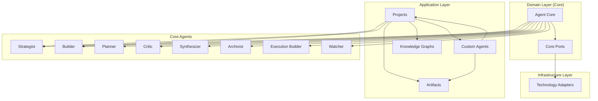

# Edge AI Agent System: Integration Guide

## Overview

This integration guide explains how the various components of the Edge AI Agent System - projects, artifacts, core agents, and custom agents - work together to create a cohesive, effective edge AI environment. It covers the relationships between components, typical workflows, deployment considerations, and best practices for system integration.

## System Architecture Overview

The Edge AI Agent System is structured as follows:



## Component Relationships

### Projects and Agents

- **Project Manager Agents** are dedicated to specific projects and coordinate activities
- **Core System Agents** provide underlying capabilities across projects
- **Custom Team Member Agents** are assigned to projects to fulfill specific roles

Flow of interaction:
1. Project Manager Agent oversees the project
2. Core System Agents provide specialized capabilities when needed
3. Custom Team Member Agents execute specific project tasks

### Artifacts and Agents

- **Core Agents** generate and consume artifacts within their domains
- **Custom Agents** are grounded in artifacts and may create new artifacts
- **Project Manager Agents** recommend appropriate cognitive artifacts

Artifact flow:
1. Cognitive artifacts structure thinking and information gathering
2. Intellectual artifacts represent work products
3. Information products emerge after quality validation

### Knowledge Graphs and System Components

Knowledge graphs connect:
- Projects to artifacts
- Artifacts to team members
- Artifacts to other artifacts
- Custom agents to their grounding

This creates a semantic network that enables:
- Context-aware recommendations
- Relationship tracking
- Intelligent retrieval
- Dependency management

## System Integration

### Core Agent Integration

Core system agents are integrated through:

1. **Agent Factory**
   ```python
   class AgentFactory:
       def create_strategist(self) -> Agent:
           llm = LiteLLMAdapter(model_name="ollama-mistral")
           memory = RedisMemoryAdapter(agent_id="strategist")
           comms = RedisPubSubA2AAdapter(agent_id="strategist")
           return Agent(agent_id="strategist", system_prompt=STRATEGIST_PROMPT,
                       llm=llm, memory=memory, communication=comms)
   ```

2. **Agent Orchestrator**
   ```python
   class AgentOrchestrator:
       def __init__(self, agents: Dict[str, Agent]):
           self.agents = agents

       def dispatch_task(self, agent_id: str, task: Dict[str, Any]) -> Dict[str, Any]:
           if agent_id not in self.agents:
               raise ValueError(f"Unknown agent: {agent_id}")
           return self.agents[agent_id].process_task(task)
   ```

3. **Task Router**
   ```python
   def route_task(task_type: str) -> str:
       """Route a task to the appropriate agent based on type."""
       routing_map = {
           "strategic_planning": "strategist",
           "code_generation": "builder",
           "task_scheduling": "planner",
           "risk_assessment": "critic",
           "content_summarization": "synthesizer",
           "knowledge_indexing": "archivist",
           "deployment_building": "execution_builder",
           "system_monitoring": "watcher"
       }
       return routing_map.get(task_type, "strategist")  # Default to strategist
   ```

### Project-Agent Integration

Projects connect to agents through:

1. **Project Service**
   ```python
   class ProjectService:
       def __init__(self, agent_factory: AgentFactory):
           self.agent_factory = agent_factory

       def create_project(self, name: str) -> Project:
           # Create a new project manager agent for this project
           project_manager = self.agent_factory.create_project_manager()

           # Create the project structure
           project = Project(
               id=str(uuid.uuid4()),
               name=name,
               manager_agent=project_manager.agent_id,
               case_file_path=f"/projects/{name}"
           )

           # Initialize knowledge graph
           self._init_project_graph(project.id)

           return project
   ```

2. **Team Assignment**
   ```python
   class TeamService:
       def assign_member(self, project_id: str, member_type: str,
                        member_name: str, behavior_type: Optional[str] = None) -> TeamMember:
           # Create team member (human or AI)
           if member_type == "human":
               team_member = TeamMember(
                   id=str(uuid.uuid4()),
                   name=member_name,
                   type="human"
               )
           else:  # AI agent
               team_member = TeamMember(
                   id=str(uuid.uuid4()),
                   name=member_name,
                   type="ai",
                   behavior=behavior_type or "reactive"
               )

           # Add to project
           self._add_to_project(project_id, team_member.id)

           return team_member
   ```

### Artifact Integration

Artifacts are integrated through:

1. **Artifact Service**
   ```python
   class ArtifactService:
       def create_artifact(self, project_id: str, owner_id: str,
                          artifact_type: str, content: str, metadata: Dict) -> Artifact:
           artifact = Artifact(
               id=str(uuid.uuid4()),
               project_id=project_id,
               owner_id=owner_id,
               type=artifact_type,
               path=self._generate_path(project_id, artifact_type),
               locked=False
           )

           # Store artifact content
           self._write_artifact(artifact.path, content)

           # Update knowledge graph
           self._update_graph(artifact)

           return artifact
   ```

2. **Artifact Recommendation**
   ```python
   def recommend_cognitive_artifacts(project_id: str, task_context: str) -> List[str]:
       """Recommend appropriate cognitive artifacts for a given context."""
       # Query the knowledge graph for relevant cognitive artifacts
       # based on task context, project stage, and available artifacts
       return graph_service.query_artifacts(
           project_id=project_id,
           artifact_type="cognitive",
           context=task_context
       )
   ```

### Custom Agent Integration

Custom agents are integrated through:

1. **Custom Agent Service**
   ```python
   class CustomAgentService:
       def create_custom_agent(self, name: str, behavior_type: str,
                              grounding_artifacts: List[str], config: Dict) -> str:
           # Validate grounding artifacts
           for artifact_id in grounding_artifacts:
               if not artifact_service.artifact_exists(artifact_id):
                   raise ValueError(f"Artifact {artifact_id} does not exist")

           # Create agent configuration
           agent_config = {
               "id": str(uuid.uuid4()),
               "name": name,
               "behavior_type": behavior_type,
               "grounding_artifacts": grounding_artifacts,
               "tools": config.get("tools", []),
               "memory": config.get("memory", {"type": "dict"}),
               "agent_script": config.get("agent_script", "")
           }

           # Register the agent
           agent_id = self._store_agent_config(agent_config)

           return agent_id
   ```

2. **Agent Library Integration**
   ```python
   class AgentLibraryService:
       def publish_agent(self, agent_id: str,
                         description: str, tags: List[str]) -> bool:
           """Publish an agent to the shared library."""
           agent = custom_agent_service.get_agent(agent_id)

           # Add to library with metadata
           library_entry = {
               "agent_id": agent_id,
               "name": agent["name"],
               "description": description,
               "tags": tags,
               "creator_id": get_current_user_id(),
               "created_at": datetime.now().isoformat(),
               "version": "1.0.0"
           }

           return self._add_to_library(library_entry)
   ```

## Typical Workflows

### Project Creation and Setup

1. **Initialize Project**
   ```python
   project = project_service.create_project("AI Research Project")
   ```

2. **Set Up Project Manager Agent**
   ```python
   # Project manager is created automatically with the project
   project_manager_id = project.manager_agent
   ```

3. **Add Team Members**
   ```python
   # Add human team member
   human_member = team_service.assign_member(
       project_id=project.id,
       member_type="human",
       member_name="John Doe"
   )

   # Add custom AI team member
   ai_member = team_service.assign_member(
       project_id=project.id,
       member_type="ai",
       member_name="Data Analyzer",
       behavior_type="semi-autonomous"
   )
   ```

### Artifact Creation Workflow

1. **Create Cognitive Artifact**
   ```python
   cognitive_artifact = artifact_service.create_artifact(
       project_id=project.id,
       owner_id=human_member.id,
       artifact_type="cognitive",
       content="# Research Questions\n1. ...\n2. ...",
       metadata={"category": "planning", "format": "markdown"}
   )
   ```

2. **Develop Intellectual Artifact**
   ```python
   intellectual_artifact = artifact_service.create_artifact(
       project_id=project.id,
       owner_id=ai_member.id,
       artifact_type="intellectual",
       content="# Research Analysis\n## Findings\n...",
       metadata={"based_on": [cognitive_artifact.id], "format": "markdown"}
   )
   ```

3. **Publish Information Product**
   ```python
   # Review and approve intellectual artifact
   information_product = artifact_service.publish_artifact(
       artifact_id=intellectual_artifact.id,
       reviewer_id=human_member.id,
       approval_notes="Verified and approved after peer review."
   )
   ```

### Custom Agent Creation

1. **Create Grounding Artifacts**
   ```python
   # Create cognitive artifact describing agent purpose
   purpose_artifact = artifact_service.create_artifact(
       project_id=project.id,
       owner_id=human_member.id,
       artifact_type="cognitive",
       content="# Data Analysis Agent\nPurpose: Process CSV data...",
       metadata={"category": "agent_specification", "format": "markdown"}
   )

   # Create intellectual artifact with domain knowledge
   knowledge_artifact = artifact_service.create_artifact(
       project_id=project.id,
       owner_id=human_member.id,
       artifact_type="intellectual",
       content="# Data Analysis Procedures\n1. Data cleaning steps...",
       metadata={"category": "domain_knowledge", "format": "markdown"}
   )
   ```

2. **Create Custom Agent**
   ```python
   agent_id = custom_agent_service.create_custom_agent(
       name="Data Analyst",
       behavior_type="semi-autonomous",
       grounding_artifacts=[purpose_artifact.id, knowledge_artifact.id],
       config={
           "tools": ["read_csv", "analyze_data", "generate_plots"],
           "memory": {"type": "vector_store", "path": "./agent_memory/analyst/"},
           "agent_script": "You are a data analysis specialist..."
       }
   )
   ```

3. **Publish to Library**
   ```python
   agent_library_service.publish_agent(
       agent_id=agent_id,
       description="Data analysis agent for CSV processing and visualization",
       tags=["data", "analysis", "visualization"]
   )
   ```

### Inter-Agent Collaboration

1. **Project Manager Agent Coordination**
   ```python
   # Project manager initiates a planning task
   planning_task = {
       "type": "project_planning",
       "description": "Create a research timeline",
       "context": {"project_id": project.id}
   }

   # Strategist agent is invoked
   strategist_result = agent_orchestrator.dispatch_task("strategist", planning_task)

   # Planner agent then creates detailed schedule
   planning_result = {
       "type": "schedule_creation",
       "description": "Create detailed task schedule",
       "context": {
           "project_id": project.id,
           "strategic_plan": strategist_result["plan_id"]
       }
   }

   schedule = agent_orchestrator.dispatch_task("planner", planning_result)
   ```

2. **Custom Agent Invocation**
   ```python
   # Project manager recommends using a custom agent
   recommendation = project_manager_agent.process_task({
       "type": "team_recommendation",
       "context": {"project_id": project.id, "task": "data_analysis"}
   })

   # Custom agent is invoked
   data_analysis_task = {
       "type": "analyze_data",
       "data_path": "/projects/research/data/survey.csv",
       "analysis_type": "correlation"
   }

   result = custom_agent_service.invoke_agent(
       agent_id=recommendation["recommended_agent_id"],
       task=data_analysis_task
   )
   ```

## Deployment Guide

### System Requirements

- **Hardware**: NVIDIA Jetson AGX Orin (64GB)
- **OS**: Linux-based (Ubuntu preferred)
- **Storage**: Minimum 128GB SSD
- **Network**: Local network for multi-device setups

### Component Deployment

1. **Core Infrastructure**
   - Redis for memory and messaging
   - Local model server (Ollama, Triton)
   - API server (FastAPI)

2. **Model Deployment**
   - Quantized models appropriate for each agent
   - Shared embedding model

3. **Storage Deployment**
   - Case file directory structure
   - Vector database for semantic search

4. **Agent Deployment**
   - Core system agents
   - Initial project manager agent template
   - Baseline custom agent library

### Configuration

Example `config.yaml`:
```yaml
system:
  base_path: "/opt/edge-ai-system"
  log_level: "info"
  debug_mode: false

models:
  model_server: "ollama"  # "ollama", "triton", or "tensorrt"
  server_url: "http://localhost:11434"
  models:
    strategist: "mistral-7b-q4"
    builder: "codellama-7b-q4"
    planner: "phi-2"
    critic: "mistral-7b-q4"
    synthesizer: "mistral-7b-q4"
    archivist: "phi-2"
    execution_builder: "codellama-7b-q4"
    watcher: "phi-2"
  embedding_model: "all-MiniLM-L6"

memory:
  provider: "redis"  # "redis", "file", or "memory"
  url: "redis://localhost:6379"
  ttl: 86400  # 24 hours in seconds

communication:
  provider: "redis"  # "redis" or "file"
  url: "redis://localhost:6379"
  channels:
    agent_messages: "edge_ai:agent_messages"
    system_events: "edge_ai:system_events"

storage:
  projects_path: "/data/projects"
  artifacts_path: "/data/artifacts"
  agent_library_path: "/data/agent_library"
  knowledge_graphs_path: "/data/knowledge_graphs"

api:
  host: "0.0.0.0"
  port: 8000
  enable_docs: true
  auth_enabled: true
```

## Runtime Optimization

### Resource Management

1. **Model Sharing**
   - Share models between agents where appropriate
   - Use a single embedding model across agents

2. **Lazy Loading**
   - Load models only when needed
   - Unload inactive models to free resources

3. **Priority Scheduling**
   - Schedule high-priority agents first
   - Queue lower-priority tasks

4. **Memory Management**
   - Clear context windows after use
   - Use efficient storage for long-term memory

### Performance Monitoring

Monitor system performance with metrics such as:
- Model inference time
- Agent response time
- Memory usage
- GPU utilization
- Task queue length
- Error rates

Example monitoring setup:
```python
@app.middleware("http")
async def add_process_time_header(request: Request, call_next):
    start_time = time.time()
    response = await call_next(request)
    process_time = time.time() - start_time
    metrics_registry.histogram("request_process_time").observe(process_time)
    return response

@app.get("/metrics")
async def metrics():
    return Response(content=metrics_registry.generate(), media_type="text/plain")
```

## Best Practices

### Integration Best Practices

1. **Start with Core Agents**
   - Deploy core agents first
   - Add custom agents incrementally

2. **Use Consistent Communication**
   - Standardize message formats
   - Implement proper error handling

3. **Incremental Complexity**
   - Begin with simpler project structures
   - Add more sophisticated knowledge graphs as needed

4. **Test Integration Points**
   - Verify agent-to-agent communication
   - Test artifact creation and consumption flows

### Security Considerations

1. **Access Control**
   - Implement proper authentication for API access
   - Set up fine-grained permissions for artifact access

2. **Data Protection**
   - Encrypt sensitive artifacts
   - Implement backup strategies

3. **Agent Boundaries**
   - Limit custom agent access to system resources
   - Validate inputs to prevent injection attacks

4. **Monitoring**
   - Log all agent actions for audit
   - Set up alerts for unusual behavior

## Troubleshooting

Common issues and solutions:

1. **Agent Communication Failures**
   - Check communication adapter configuration
   - Verify message format conformity
   - Inspect Redis or file queue status

2. **Model Loading Errors**
   - Verify model paths and availability
   - Check for sufficient GPU memory
   - Confirm model compatibility with hardware

3. **Artifact Access Issues**
   - Validate file permissions
   - Check path generation logic
   - Verify artifact metadata integrity

4. **Knowledge Graph Inconsistencies**
   - Run graph validation tools
   - Check for orphaned references
   - Rebuild indexes if necessary

## Conclusion

The Edge AI Agent System provides a flexible, modular architecture for deploying collaborative agent networks on edge hardware. By following this integration guide, you can effectively combine projects, artifacts, and agents into a cohesive system that leverages the power of edge AI while maintaining modularity and extensibility.

The system's hexagonal architecture ensures that components can evolve independently, allowing you to update or replace specific technologies without disrupting the entire system. This adaptability is crucial in the rapidly evolving field of AI, where new models and techniques emerge regularly.

By carefully integrating the various components according to the patterns and practices outlined in this guide, you can create a robust edge AI system that supports complex, collaborative workflows while respecting the resource constraints of edge hardware.
